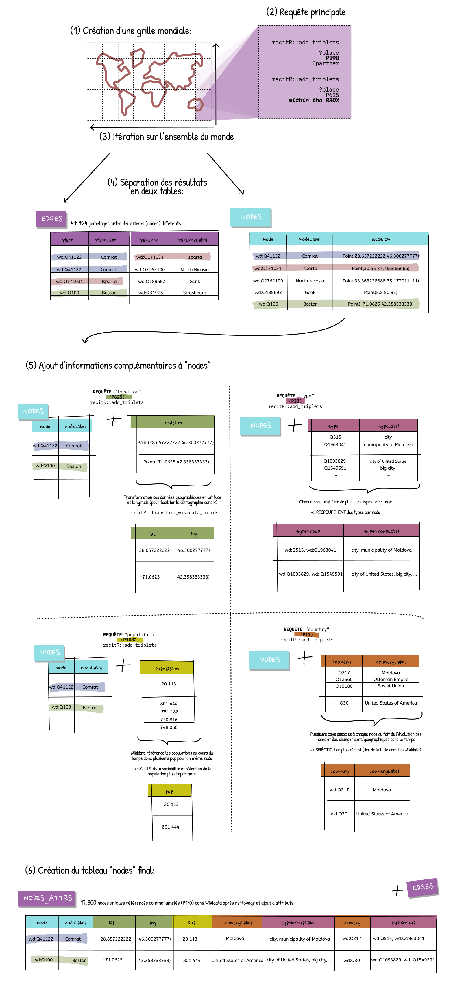

```{r setup, include=FALSE}
knitr::opts_chunk$set(warning=FALSE, message=FALSE)
```

```{r, echo=FALSE}
#library(tidyverse)
library(dplyr)
library(purrr)
library(knitr)
library(stringr)
library(ggplot2)
library(recitR) #NEW: super nouveau package !
library(leaflet) # pour la carte
library(kableExtra)
library(tidyr)
```

#  Chercher les données de jumelages dans les Wikidata

Le jumelage peut se faire à différentes échelles administratives et notamment les villes ou les communes (en France) qui peuvent être des comtés dans d'autres pays.

Dans les Wikidata la propriété qui regroupe cette question de jumelage est la propriétée `P190` "twinned administrative body" qui englobe **toutes formes d'échelons administratifs** mais majoritairement les villes et les communes/ comtés.

/!\ Attention donc car la traduction de cette prorpiété sur la [page Wikidata](https://www.wikidata.org/wiki/Property:P190) en question est fausse en français car **ne concerne pas uniquement les villes** 

Ici la logique de requête des Wikidata est la suivante: _"récupère toutes les entités `places` et les partenaires `partner` liés par la propriété `P109` "twinned administrative body"_. 
Les items `place` et `partner` en sortie peuvent donc aussi bien être des villes que des municipalités ou encore d'autres entités géographiques. Aucun tri n'est fait a priori mais comme l'information du type lié à l'objet est également requêté il est possible par exemple de ne conserver que les jumelages pour lesquels les élements récupéres sont de type ville. (cf. colonnes `typeGroupLabel` et `typeGroup` dans la tableau **nodes-attrs**) 

## Résumé illustré des étapes de la démarche



## Requête à échelle mondiale

Plusieurs échelles de requête ont été tenté pour extraire les données de jumelage dans les Wikidata et notamment les extractions des items par pays. Toutefois, des limites de capacité de requête (notament pour les grands pays) ont pu limiter et contraindre le processus. 

Pour pallier ces contraintes techniques et s'assurer une plus grande exhaustivité dans la récupération des données, il a été décidé de se baser sur un quadrillage du monde dans lequel chaque carreau représente une **bbox** dans lequel faire tourner la réquête pour récupérer les informations de jumelage qui sont présents sur ce territoire (cf. étapes 1 et 2 du schéma de résumé). Cela a été possible car les fonctionnalités de requête de **Wikidata Query Service** permettent d'intégrer des contraintes spatiales comme la définition d'une "boite de délimitation" (bbox) dans laquelle requêter les données. Cette bbox est définie en donnant les informations de coordonnées du coin Est et du coin Ouest de la bbox. La grille contient 15840 bbox d'environ 5000 km².

#### Création de la grille de bbox de coordonnées à l'échelle du monde 
```{r create_grid_from_r}
grid=tidyr::crossing(left=seq(-180,178,by=2),
                     bottom=seq(-87,87,by=2)) %>% 
  mutate(right=left+2,
         top=bottom+2)
```


#### Création de la fonction de récupération des jumelages dans les Wikidata
```{r def_get_jums}
get_jums=function(left,bottom){
    res=add_triplets(subject="?place",
                 verb="wdt:P190",
                 object="?partner",
                 label=c("?place","?partner")) %>% 
      add_triplets(subject="?place",
                   verb="wdt:P625",
                   object="?location",
                   within_box=list(southwest=c(long=left,lat=bottom),
                                   northeast=c(long=left+2,lat=bottom+2))) %>% 
      build_sparql() %>% 
      send_sparql() %>% 
      clean_wikidata_table() 
  return(res)
}
```


Pour une requête on récupère (dans la bbox en question) les informations suivantes pour chaque ligne i.e. chaque partenariat de type jumelage:

* `place` : le Wikidata de l'entité géographique jumelée
* `placeLabel` : le nom de l'entité géographique jumelée
* `location` : les coordonnées de l'entité géographique jumelée
* `partner` : le Wikidata du partenaire de jumelage de _place_
* `placeLabel` : le nom du partenaire de jumelage de _place_

#### Application de la fonction de récupération des jumelages et création de deux tables en sortie: 
*  **nodes** : contient tous les items qui font partie d'un jumelage (en tant que place ou en tant que partner)
*  **edges** : contient les liens de jumelages entre les items de la table nodes
```{r requete_initiale}
if(!file.exists("data/twinnings/edges.RDS")){
    result=purrr::map2(grid$left,
                       grid$bottom,
                       safely(get_jums))
    
    tib_result=result %>%
      map("result") %>% 
      bind_rows()
    
    nodes=bind_rows(
            tib_result %>% 
                select(node=place,
                       location=location),
            tib_result %>% 
                select(node=partner) %>% 
                left_join(tib_result %>% select(place,location) %>% unique(),
                          by=c("node"="place"))) %>%
      unique() 
    edges=tib_result %>% 
      select(place,placeLabel,partner,partnerLabel)
    
    saveRDS(nodes,"data/twinnings/nodes.RDS")
    saveRDS(edges,"data/twinnings/edges.RDS")
    }
nodes=readRDS("data/twinnings/nodes.RDS")
edges=readRDS("data/twinnings/edges.RDS")

edges <- edges %>% 
  unique()
```

#### Visualisation de la table **edges** (liens de jumelages)
```{r show_edges}
kbl(edges %>% slice(1:20)) %>% 
 kable_styling(bootstrap_options = c("striped", "hover", "condensed")) %>%
  row_spec(0, bold = TRUE) %>% 
  column_spec(1:2, bold = TRUE, color = "purple") %>% 
  column_spec(3:4, bold=TRUE, color="pink")
```


## Requête: ajout "location" (si nécessaire)

Un certain nombre de `partner` ont leur pendant du côté de `place` et à ce titre on a déjà récupéré leurs coordonnées. Pour les autres, on récupère les coordonnées comme suit.

```{r nodes_loc}
if(!file.exists("data/twinnings/nodes_loc.RDS")){
  nodes_loc1=nodes %>% 
    filter(!is.na(location)) %>% 
    select(node,location)
  nodes_loc2=nodes %>% #récupération des locations pour des items qui n'en avaient pas
    filter(is.na(location)) %>%
    select(-nodeLabel,-location) %>% 
    slice(1:3) %>% 
    group_by(node) %>% 
    tidyr::nest() %>% 
    mutate(data=purrr::map2(.x=node,
                            .y=node,
                            ~get_triplets(subject=.x,
                                          verb="wdt:P625",
                                          object="?location"))) %>% 
    tidyr::unnest(cols=data) %>% 
    ungroup()

  nodes_loc=bind_rows(nodes_loc1,
                      nodes_loc2)
  saveRDS(nodes_loc,
          "data/twinnings/nodes_loc.RDS")
}
nodes_loc=readRDS("data/twinnings/nodes_loc.RDS")
```

Nettoyage pour ne sélectionner qu'une localisation par item:
```{r show_nodes_loc}
nodes_uloc=nodes_loc %>% 
  group_by(node) %>% 
  summarise(location=first(location))
kbl(nodes_uloc %>% slice(1:20)) %>% 
  kable_styling(bootstrap_options = c("striped", "hover", "condensed")) %>%
  row_spec(0, bold = TRUE) %>% 
  column_spec(1, bold = TRUE, color = "orange")
```

## Requête: ajout nodeType

Récupération de tous les types principaux de chaque item (propriété `P31` _"est de nature directe"_) 
```{r nodes_type}
if(!file.exists("data/twinnings/nodes_type.RDS")){
  nodes_type=nodes %>%
    select(node) %>% 
    unique() %>% 
    group_by(node) %>% 
    tidyr::nest() %>% 
    mutate(data=purrr::map(.x=node,
                           .f=get_triplets,
                           verb="wdt:P31",
                           object="?type",
                           label="?type")) %>% 
    tidyr::unnest(cols=data) %>% 
    ungroup()
  saveRDS(nodes_type,"data/twinnings/nodes_type.RDS")
}  
nodes_type=readRDS("data/twinnings/nodes_type.RDS")
```

Dans nodes_type un noeud != une ligne car un noeud peut avoir plusieurs types principaux, i.e. être référencé à la fois comme "big city" + "city" + "capital" + "city with millions of inhabitants" + etc

Pour faciliter la lecture et ramener les types associés à un même objet dans notre tableau on **concatène** tous les types associées à un noeud dans deux nouvelles colonnes respectivement "typeGroup" et "typeGroupLabel".

```{r nodes_utype}
nodes_utype=nodes_type %>%
  clean_wikidata_table() %>% 
  group_by(node) %>%
  mutate(typeGroup=str_c(unique(type),collapse=", ")) %>%
  mutate(typeGroupLabel=str_c(unique(typeLabel),collapse=", ")) %>% 
  select(-type,-typeLabel) %>% 
  unique()
```


> N.B: c'est grâce à cette information qu'on peut trier les résultats en fonction de leur types qui nous intéressent (cf. partie **Analyse des résultats** )

## Requête: ajout "country"

```{r nodes_country}
if(!file.exists("data/twinnings/nodes_country.RDS")){
  nodes_country <- nodes%>%
    select(node) %>% 
    unique() %>% 
    group_by(node) %>% 
    tidyr::nest() %>%
    mutate(data=purrr::map(.x=node,
                           get_triplets,
                           verb="wdt:P17",
                           object="?country",
                           label="?country")) %>% 
    tidyr::unnest(cols=data) %>% 
    ungroup()
  saveRDS(nodes_country,"data/twinnings/nodes_country.RDS")
}
nodes_country=readRDS("data/twinnings/nodes_country.RDS")
```

Nettoyage pour ne sélectionner qu'un pays par item (ici le premier car est généralement le dernier en date i.e. l'actuel référencé dans les Wikidata) 
```{r show_nodes_country}
nodes_ucountry=nodes_country %>% 
  group_by(node) %>% 
  summarise(country=first(country), countryLabel=first(countryLabel))
kbl(nodes_ucountry %>% slice(1:20)) %>% 
  kable_styling(bootstrap_options = c("striped", "hover", "condensed")) %>%
  row_spec(0, bold = TRUE) %>% 
  column_spec(1, bold = TRUE, color = "orange")
```

## Requête: ajout "population"

```{r node_pop}
if(!file.exists("data/twinnings/nodes_pop.RDS")){
  tmp1=Sys.time()
  nodes_pop <- nodes%>%
    select(node) %>% 
    unique() %>% 
    group_by(node) %>% 
    tidyr::nest() %>%
    mutate(data=purrr::map(.x=node,
                           safely(get_triplets),
                           verb="wdt:P1082",
                           object="?pop")) %>% 
    mutate(data=purrr::map(data,"result")) %>% 
    tidyr::unnest(cols=data,keep_empty=TRUE) %>% 
    ungroup()
  saveRDS(nodes_pop,"data/twinnings/nodes_pop.RDS")
}
nodes_pop=readRDS("data/twinnings/nodes_pop.RDS")
```

#### Requête: ajout de "pop":

**Nota bene**: pour un même noeud plusieurs populations (au cours du temps) peuvent être référencées dans les Wikidata. On vérifie alors si la population est peu instable dans le temps (i.e. un `how_variable` faible) alors on prend la population médiane, sinon on prend le maximum (ce qui est ici le cas pour partner et pour place).


Vérification de la stabilité des populations associées à chaque `place` dans le temps et choix de la **population maximale**
```{r pop_var}
# Pour vérifier à quel point la valeur de pop est "instable"
nodes_pop%>%
  group_by(node) %>% 
  summarise(n=n_distinct(pop),
            median_pop=median(pop),
            how_variable=diff(range(pop))/median_pop,
            .groups="drop") %>% 
  arrange(desc(n))
```

Ligne 6 on voit par exemple que la population de `wd:Q168202` est instable i.e. avec un `how_variable` plutôt élevé. Si l'on va regarder la [page Wikidata de l'item](https://www.wikidata.org/wiki/Q168202) du noeud en question il s'agit d'une ville d'Israel dont de nombreuses populaitons sont référencées au cours du temps (tous les ans depuis 1950 dans ce cas).

 Si c'est pas trop variable alors on peut prendre la médiane 
 (si vraiment c'est problématique on peut aussi sélectionner le "how_variable" dans le tableau popPlace avant jointure mais je crois pas non plus que Ninon a besoin de valeurs de pops ultra fiables, a priori, c'est plus pour faire de la catégorisation donc si c'est ok en terme d'ordre de grandeur ça devrait le faire...)

Si est trop variable alors on prend le MAX (qui est dans la majorité des cas ce qui se produit i.e. augmentation de la pop urbaine dans le temps)


```{r, nodes_upop}
nodes_upop=nodes_pop%>%
  group_by(node) %>% 
  summarise(n=n_distinct(pop),
            median_pop=median(pop),
            how_variable=diff(range(pop))/median_pop,
            max_pop=max(pop),
            .groups="drop") %>% 
  select(node,
         pop=max_pop)
```

# Tableau complet des attributs (nodes_attrs)

Jointure dans un tableau final des données récupérées pour chaque noeud à savoir: 

* localisation
* type principal
* pays 
* population

```{r nodes_attrs}
if(!file.exists("data/twinnings/nodes_attrs.RDS")){
nodes_attrs=nodes_uloc %>% 
  left_join(nodes %>% select(node,nodeLabel) %>% unique(),by="node") %>% 
  left_join(nodes_utype,by="node") %>% 
  left_join(nodes_ucountry,by="node") %>%
  left_join(nodes_upop,by="node") %>% 
  clean_wikidata_table() %>% 
  transform_wikidata_coords(coord_column="location") %>% 
  select(node,nodeLabel,lng,lat,pop,countryLabel,typeGroupLabel,country,typeGroup)

  saveRDS(nodes_attrs,"data/twinnings/nodes_attrs.RDS")
}

nodes_attrs=readRDS("data/twinnings/nodes_attrs.RDS")
  
```


```{r}
kbl(nodes_attrs %>% select(-starts_with("type")) %>% slice(1:10)) %>%
  kable_styling(bootstrap_options = c("striped", "hover", "condensed")) %>%
  row_spec(0, bold = TRUE) %>% 
  column_spec(1:2, bold = TRUE, color = "orange") %>%
  column_spec(3:4, bold = TRUE, color = "lightblue") 
```


# Analyser les résultats

### Types de lieu les plus présents dans les données:

```{r stat type place}
statTypPlace <- nodes_attrs %>% 
  group_by(typeGroupLabel, typeGroup) %>% 
  count(typeGroupLabel, typeGroup) %>%
  arrange(desc(n))

kbl(statTypPlace[1:10, 1:3]) %>%
  kable_styling(bootstrap_options = c("striped", "hover", "condensed"))
```


### Filtrer les types intéressants:

Items Wikidata utiles pour filtrer les données en fonction de leur type (liste non exhaustive):

* `Q515` city
* `Q7930989` city/town
* `Q702492` urban area


#### Ville portuaire:

- `Q2264924` "port settlement" 
- propriété `P206` "located in or next to body of water"

```{r jums_port}
jums_port <- nodes_attrs %>%
  filter_all(any_vars(str_detect(., 'wd:Q2264924,'))) 
#nrow(jums_port)
#head(jums_port)
```
On compte **`r nrow(jums_port)` villes portuaires** dans les données récupérées.

#### Capitale administrative: 
- `Q5119` "capitale" 
- propriété `P1376` "capital of"

```{r jums_capitale}
jums_capitale_admin <- nodes_attrs %>%
  filter_all(any_vars(str_detect(., 'wd:Q5119,'))) 

#nrow(jums_capitale_admin)
#head(jums_capitale_admin)
```
On compte **`r nrow(jums_capitale_admin)` capitales administratives** dans les données récupérées.  

#### Ville frontalière: 
- `Q902814` "ville frontalière": récupère les villes situées physiquement sur une frontière 
- propriété `P47` "shares border with" (attention réponse multiple et non binaire, une même ville peut être transfrontalière de plusieurs pays/ régions etc)


```{r jums_frontalier}
jums_frontiere <- nodes_attrs %>%
  filter_all(any_vars(str_detect(., 'wd:Q902814,')))
#nrow(jums_port)
#head(jums_port)
```
On compte **`r nrow(jums_port)` villes frontalières** dans les données récupérées.


### Comparer les données Wikidata avec d'autres sources de données institutionnelles

**3 jeux de données** sont utilisés pour **comparer** avec les données issues des **Wikidata** et essayer d'estimer la qualité de ces dernières, notamment en terme d'exaustivité.


* [CNCD](https://pastel.diplomatie.gouv.fr/cncdext/dyn/public/atlas/accesMonde.html): "Commission Nationale de la Coopération Décentralisée",  **centré sur la France** et recense en plus des jumelages les autres formes de coopération sans suppression de coopérations passées. Filtrage uniquement des jumelages pour la comparaison.
Logique de conservation des données dans le temps, pas nécessairement de nettoyage sur les coopérations passées (qui sont aussi entendue au sens de jumelage)


* [a.f.c.c.r.e](http://afccre.org/fr/nos-membres/annuaire-des-villes-jumelees) : "Association Française du Conseil des Communes et Régions d'Europe", **centré sur la France**, annuaire des villes françaises, filtrage par pays partenaire ou région/commune/collectivité française.
Base de données référencée à l'échelle de la région et des communes donc potentiellment plus exhaustive, toutfois pas d'accès directe à l'intégralité de leur BD pour réutilisation.


* [Statistiques gov.UK](https://www.ons.gov.uk/peoplepopulationandcommunity/populationandmigration/populationestimates/datasets/twinnedtownsandsistercities): "Twinned towns and sister cities", **échelle des villes britanniques** possibilité de télecharger les données en excel (cf. fichier `data/jumelages/UK_twinned_towns2018`). Les dernières informations datent de 2018 et la thématique est a priori exactement la même que dans nos requêtes des Wikidata: "Villes jumelées et villes sœurs". Donne à voir les villes britanniques qui ont un lien de jumelage avec des villes de pays européens, principalement en France et en Allemagne, sur la base des informations fournies sur les sites web des conseils ou des associations de jumelage en septembre 2020."


```{r add country to edges, echo=FALSE}
##Ajout des informations de pays de chaque jumelage (pour place et pour partner):
#PLACE
edges_country = edges %>% left_join(nodes_attrs %>%
                                         select(node, country, countryLabel) %>%
                                         unique(),
                                       by = c("place" = "node"))

edges_country <- edges_country %>% 
  rename(placeCountry=country, placeCountryLabel=countryLabel)

#PARTNER
edges_country = edges_country %>% left_join(nodes_attrs %>%
                                         select(node, country, countryLabel) %>%
                                         unique(),
                                       by = c("partner" = "node"))

edges_country <- edges_country %>% 
  rename(partnerCountry=country, partnerCountryLabel=countryLabel)
```


```{r filter edges_country with FR, echo=FALSE}
edges_country_Fr <- edges_country %>% 
  group_by(placeCountry, placeCountryLabel, partnerCountry, partnerCountryLabel) %>%
  unique() %>% 
  filter(placeCountry == 'wd:Q142') %>% 
  filter(partnerCountry !='wd:Q142') %>% 
  count(partnerCountry) %>% 
  arrange(desc(n))
```

```{r filter edges_country with UK, echo=FALSE}
edges_country_UK <- edges_country %>%
  group_by(placeCountry, placeCountryLabel, partnerCountry, partnerCountryLabel) %>%
  unique() %>% 
  filter(placeCountry == 'wd:Q145') %>% 
  filter(partnerCountry !='wd:Q145') %>% 
  count(partnerCountry) %>% 
  arrange(desc(n))
```

```{r reading data from gov.UK, echo=FALSE}
#Téléchargement des données de "Stat gov.UK" pour comparaison avec la 3ème BD (sur le Royaume-Unis)
library(readxl)
UK_twinned2018 <- read_excel("data/twinnings/UK_twinned_towns2018.xlsx", sheet = "Databook 2018")

df_UK_twinned2018 <- as.data.frame(UK_twinned2018)

twinUK_country_group <- df_UK_twinned2018 %>%
  group_by(df_UK_twinned2018$`EUR Country`) %>% 
  count(df_UK_twinned2018$`EUR Country`) %>% 
  arrange(desc(n))
```

#### Tableau comparatif:
_N.B: **n** renvoie au nombe de jumelages récupéré dans les Wikidata_

```{r  tabelau comparatif, echo=FALSE}
compare_DB_jums <- data.frame (pays_partenaires = c("France/Allemagne", 
                                                    "France/Italie",
                                                    "France/UK",  
                                                    "France/Espagne", 
                                                    "France/Pologne",
                                                    "France/Belgique",
                                                    "France/USA", 
                                                    "France/Portugal", 
                                                    "France/Roumanie", 
                                                    "France/Suisse",
                                                    "France/Chine",
                                                    "France/Israel",
                                                    "France/Russie",
                                                    "France/Canada",
                                                    "France/Mali", 
                                                    "France/Japon",
                                                    "France/Maroc",
                                                    "France/Ireland",
                                                    "France/Rep.Tchèque",
                                                    "France/Hongrie",
                                                    "France/Burkina Faso",
                                                    "France/Grèce",
                                                    "France/Palestine",
                                                    "France/Autriche",
                                                    "France/Sénégal",
                                                    "UK/Allemagne", 
                                                    "UK/USA", 
                                                    "UK/Italie", 
                                                    "UK/Pologne", 
                                                    "UK/Chine"),
                               Wikidata = bind_rows(edges_country_Fr[1:25, 5], edges_country_UK[2:6,5]),
                               afccre = c(2226, 949, 1082, 539, 260, 321, 111, 183, 233, 102, 27, 40, 35, 38, 40, 22, 15, 164, 68, 62, 31, 42, 11, 38, 28, NA,NA, NA, NA, NA),
                               CNCD = c(2393, 834, 1012, 477, 148, 295, 109, 151, 127, 69, 23, 37, 27, 182, 69, 41, 12, 137, 62, 53, 64, 49, 9, 51, 28, NA,NA, NA, NA, NA),
                               UK_twinned_2018 = c(NA, NA, 30, NA, NA, NA, NA, NA, NA, NA, NA, NA, NA, NA, NA,  NA, NA, NA,NA, NA, NA, NA, NA, NA, NA, 49, 0,  3, 0, 0)
                               )

kbl(compare_DB_jums) %>%
  kable_styling(bootstrap_options = c("striped", "hover", "condensed"))
```


```{r graph comparison database, echo=FALSE, fig.width=25,fig.height=15}
compare_DB_jums %>%
  gather("Type", "Value",-pays_partenaires) %>%
  ggplot(aes(pays_partenaires, Value, fill = Type)) +
  geom_bar(position = "dodge", stat = "identity") +
  #geom_text(aes(label=Value), vjust=1.6, color="black", size=3.5) +
  theme_bw(base_size=25) +
  labs(x = "Pays partenaire de jumelages", y = "Nombre de jumelages", title = "Comparaison du nombre de jumelages par pays partenaires dans différentes bases de données") +
  theme(axis.text.x = element_text(angle=50), plot.title = element_text(size=30, hjust=0.2)) +
  scale_fill_discrete(name = "Base de donnée \n de provenance", labels=(c("afccre"="afccre (France)", "CNCD"="CNCD (France)","n"="Wikidata (monde)", "UK_twinned_2018"="Stat UK 2018 (Angleterre)"))) 
```


#### Lecture des résultats: 

* **CNCD** et encore plus **afccre** référencent plus de jumelages que Wikidata notamment pour les pays partenaires avec la France qui comptent un grand nombre de jumelages (Allemagne, Italie, UK, Espagne, Belgique, Pologne, Portugal, Ireland, Hongrie), particulièrement pour les pays européens

* **Wikidata** référence plus de jumelages que les autres bases de données pour des pays en dehors de l'Europe i.e. avec d'autres continents (USA, Israel, Chine, Japon, Russie, Maroc, Palestine)

* Pour quelques pays **CNCD** a le plus de jumelages référencés (Canada, Burkina Faso, Mali)

* Les 5 pays comparés avec la base de données des villes britanniques de **gov.UK** tendent à montrer que ces dernières sont lacunaires par rapport aux données de Wikidata 

**Wikidata** présente l'avantage de faciliter la récupération de la données par des requêtes automatisables. De plus il semblerait que les données récupérées grâce aux Wikidata préssentent une actualité et une valeur symbolique plus importante que dans les autres BD (car renseignées par des personnes non explicitement rattachées à une institution). EN terme d'exhausitivité, si les données Wikidata peuvent être moins précises à des échelles très fines (niveau des communes) elles ont le grand avantage d'offrir une couverture à échelle mondiale et de permettre ainsi d'aborder la question des jumaleges à échelle globale. 

